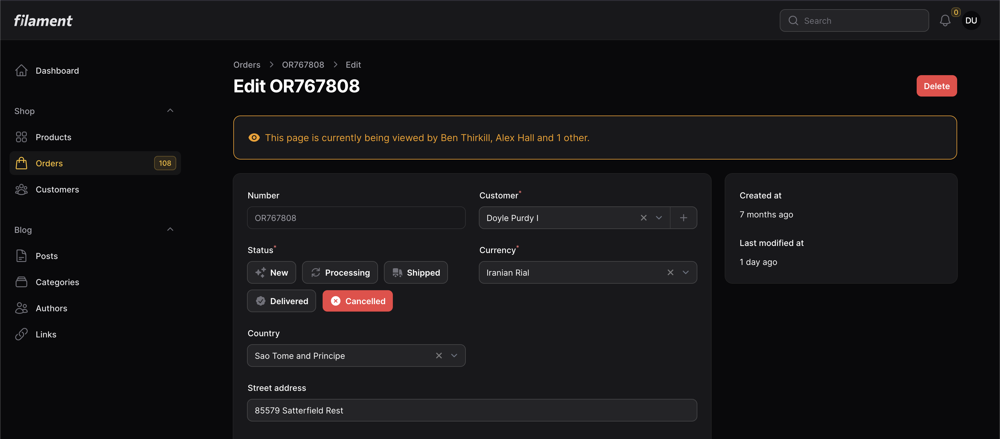

# Filament Gaze

👀 See who's viewing a resource in Filament PHP 🔭



This packages allows you to display when other users are viewing the same resource in Filament PHP.

https://packagist.org/packages/owainjones74/filament-gaze

## How to use
1. Install the package using `composer require owainjones74/filament-gaze`
2. Add `\OwainJones74\FilamentGaze\FilamentGazePlugin::make()` to your Filament Panel provider. 
```
$panel->plugins([
    \OwainJones74\FilamentGaze\FilamentGazePlugin::make()
])
```
3. Import the package inside your Filament Resource with `use OwainJones74\FilamentGaze\Forms\Components\GazeBanner`.
4. Add the `GazeBanner` form component to your form with `GazeBanner::make()`.
5. If required, publish the translation files with `php artisan vendor:publish --tag=filament-gaze-translations`.

## Examples

### Basic Example
```php
<?php

namespace App\Filament\Resources;

use OwainJones74\FilamentGaze\Forms\Components\GazeBanner;
// ...

class OrderResource extends Resource
{
    // ...

    public static function form(Form $form): Form
    {
        return $form
            ->schema([
                GazeBanner::make(),
                    
                // ...
            ]);
    }
    
    // ...
}
```

### Poll Timer Example
```php
GazeBanner::make()
    ->pollTimer(10),
```

### Identifier Example
```php
GazeBanner::make()
    ->identifier('any-order'),
```

### Hiding Gaze Banner on Create Form Example
```php
GazeBanner::make()
    ->hidden(fn (?Order $record) => $record === null),
```


## Docs

### `->pollTimer($timeInSecs)`

#### Description
`polltimer` can be used to set how often the browser should inform Filament that the use is still viewing the page, along with getting an updated list of other users also viewing. It is advised not to put this value too short, as it can cause rate limiting issues. But also not to have this value too long, as it will result in a delayed update of new users viewing the page.

#### Arguments
`timeInSeconds` - (int) The amount of time in seconds between each poll. Default is 30 seconds.

### `->identifier($name)`

#### Description
`identifier` is used as a unique identifier for this gaze banner. Any other gaze banners with the same identifier will share the same list of active users. This can be useful if you want 2 or more difference resources to share the same list of active viewing users.

#### Arguments
`name` - (string) The name of the identifier. Default is the resource's model class combines with model Id.
